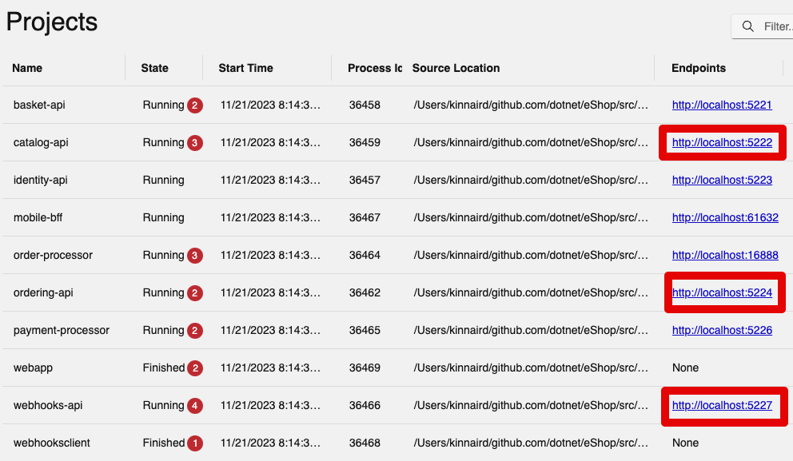
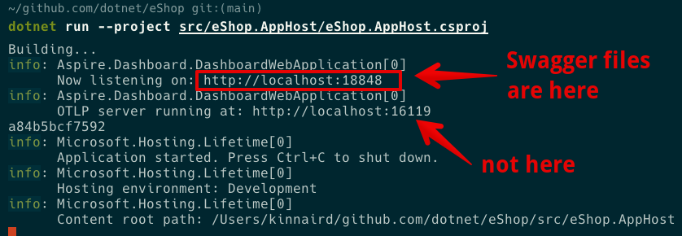

# eShop

[eShop](https://github.com/dotnet/eShop) has OpenAPI specs for the different services:

1. [Catalog API](https://github.com/dotnet/eShop/tree/main/src/Catalog.API), hosted at http://localhost:5222
2. [Ordering API](https://github.com/dotnet/eShop/tree/main/src/Ordering.API), hosted at http://localhost:5224
3. [Webhooks API](https://github.com/dotnet/eShop/tree/main/src/Webhooks.API), hosted at http://localhost:5227

I have included the Swaggerfiles for each of these within this subdirectory.

# How did you grab the Swagger docs?

I followed the instructions on eShop to start the app locally. It was pretty easy to run it on my Mac (M2).

I navigated to those localhost URLs at the dashboard and then clicked on the links, and it brought me directly to that page.

# What are the other APIs?

The other links appear to be either RPC APIs or other dashboards/services that do not have Swagger files. I am not 100% sure that they do not need them, only that they do not have them.